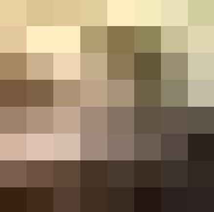

This algorithm allows you to compare identical images, even if they have
minor changes (can be used to identify duplicates on the server).

Algorithm steps:

1.  Reducing the dimension to 8x8 pixels using the PIL library

> 
2.  Converting an image to grayscale

3.  Binarization by average

> 

4.  Comparison of images by superimposing the resulting binarized
    matrices. The greater the discrepancy (Hamming distance), the more
    the images differ from each other.
